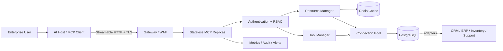

# Retail Enterprise MCP Portfolio

A complete enterprise portfolio that connects AI clients to retail customer, inventory, sales, order, and support capabilities through the Model Context Protocol (MCP). It combines strategic assessment, a working server, and production security/deployment artifacts in one repository.

## Portfolio coverage

1. **MCP architecture assessment and design:** [architecture](docs/architecture.md), [MCP evaluation](docs/evaluation.md), [risk assessment](docs/risk-assessment.md), [ROI](docs/roi.md), and [executive summary](docs/executive-summary.md).
2. **Production MCP server:** resources, tools, prompt, PostgreSQL adapter, Redis cache, connection pool, validation, transactions, idempotency, tests, and API documentation.
3. **Enterprise framework:** [security](docs/security.md), Prometheus/Grafana, Docker, Kubernetes, TLS gateway, CI/CD, [deployment](docs/deployment.md), and [disaster recovery](docs/disaster-recovery.md).

## Architecture



The editable diagram is [docs/architecture.mmd](docs/architecture.mmd).

## MCP contract

### Resources

| URI template | Permission | Description |
|---|---|---|
| `retail://customers/{customer_id}` | `customer:read` | Customer profile with role-based PII filtering |
| `retail://inventory/{sku}` | `inventory:read` | Quantity, reorder threshold, and price |
| `retail://sales/{sale_id}` | `sales:read` | Confirmed retail sale |

### Tools

| Tool | Permission | Safety property |
|---|---|---|
| `process_order` | `order:write` | Transaction, row lock, idempotency key, stock validation |
| `update_inventory` | `inventory:write` | Bounds validation, non-negative invariant, cache invalidation |
| `create_support_ticket` | `ticket:write` | Length/control-character validation and audit event |

The `investigate_customer_issue` prompt provides workflow guidance but grants no permission.

## Quick start

Prerequisites: `asdf`, `uv`, and optionally Docker. The repository pins Python in
`.tool-versions`, following the workspace standard.

```bash
asdf install
asdf current python
cp .env.example .env
uv sync --python "$(asdf which python)" --extra dev
uv run pytest
uv run retail-mcp --transport http
```

In another terminal, run the non-destructive protocol smoke test, or let it manage a
temporary local server with `--start-server`:

```bash
uv run python scripts/smoke_test.py
uv run python scripts/smoke_test.py --start-server
```

Connect an MCP client to `http://localhost:8000/mcp` and send one of these headers:

```text
X-API-Key: dev-admin-key
```

or:

```text
Authorization: Bearer dev-admin-key
```

Bundled keys work only in development. Production mode rejects them. For STDIO:

```bash
RETAIL_MCP_STDIO_API_KEY=dev-admin-key uv run retail-mcp --transport stdio
```

## Full stack

```bash
docker compose up --build -d
docker compose ps
curl http://localhost:8000/health/ready
```

Services:

- MCP server: `localhost:8000/mcp`
- Prometheus: `localhost:9090`
- Grafana: `localhost:3000`
- PostgreSQL and Redis: private Compose network only

See [deployment.md](docs/deployment.md) for production Compose, Kubernetes, TLS, secrets, SLOs, scaling, and rollback.

## Configuration

All settings use the `RETAIL_MCP_` prefix.

| Variable | Purpose | Production requirement |
|---|---|---|
| `ENVIRONMENT` | `development`, `test`, or `production` | `production` |
| `DATA_BACKEND` | `memory` or `postgres` | `postgres` |
| `DATABASE_URL` | PostgreSQL DSN | Secret |
| `REDIS_URL` | Shared cache URL | Secret/private endpoint |
| `API_KEYS` | JSON key/subject/role records | Secret; no `dev-*` keys |
| `STDIO_API_KEY` | Credential for local STDIO process | Environment secret |
| `RATE_LIMIT_PER_MINUTE` | Per-principal application limit | Tune from load test |
| `REQUEST_TIMEOUT_SECONDS` | Dependency operation timeout | Below gateway timeout |

Example `API_KEYS` value:

```json
[
  {"key": "a-long-random-secret", "subject": "support-agent", "role": "customer_service"}
]
```

API keys are the scenario's required authentication mechanism. Enterprise evolution should replace them with OAuth 2.1 and audience-bound tokens while retaining the same `Principal` and RBAC boundary.

## Quality and validation

```bash
uv run ruff check .
uv run ruff format --check .
uv run pytest
docker compose config
docker build -t retail-mcp:local .
```

The CI pipeline performs linting, tests with coverage, package build, dependency review, and container build. Before production, add organization-specific SAST, secret scanning, image vulnerability scanning, signing, provenance, and deployment approval.

## Repository map

```text
src/retail_mcp/       MCP server and enterprise application layers
tests/                Unit, authorization, resilience, and API tests
migrations/           PostgreSQL schema and seed data
monitoring/           Prometheus alerts and provisioned Grafana dashboard
deploy/               TLS gateway and Kubernetes deployment/HPA
docs/                 Architecture, business, security, operations, and DR
.github/workflows/    CI pipeline
```

## Important limitations

- The API-key manager is intentionally replaceable; use the corporate IdP for user-delegated production access.
- The sample is single-tenant. Tenant identity must be enforced in principals, queries, row policies, and cache keys before multi-tenant use.
- The PostgreSQL projection represents integration with systems of record; real CRM/ERP adapters and synchronization are organization-specific.
- Performance and ROI figures are hypotheses until validated with production-like load tests and business measurements.
