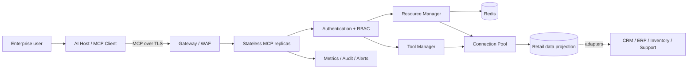
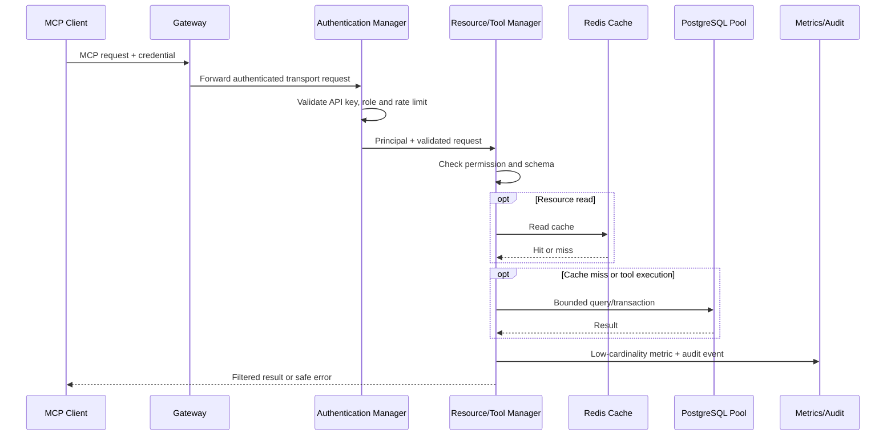

# Architecture assessment and design

## Decision

The solution uses a stateless Streamable HTTP MCP tier behind a TLS gateway. It exposes focused retail resources and tools while adapters isolate the MCP protocol from CRM, ERP, inventory, and support systems. PostgreSQL represents the durable integration projection; Redis provides shared caching; Prometheus, Grafana, and structured audit logs provide observability.

The source diagram is [architecture.mmd](architecture.mmd):

## Six internal components

1. **Authentication manager** validates credentials and resolves roles.
2. **Resource manager** retrieves, caches, filters, and audits contextual data.
3. **Tool manager** validates and executes state-changing operations transactionally.
4. **Connection pool** bounds concurrent database use and reuses connections.
5. **Cache** reduces latency and protects systems of record from repeated reads.
6. **Metrics subsystem** measures throughput, latency, errors, cache efficiency, and dependency health.

## Key decisions

| Decision | Rationale | Trade-off |
|---|---|---|
| Streamable HTTP, stateless JSON mode | Recommended production transport and horizontal scaling model | Long-lived server-side session state is not retained |
| Server-enforced RBAC | Authorization remains deterministic and cannot be overridden by the model | Roles and permissions require governance |
| Resource/tool separation | Read context is separated from side effects | Some workflows require two MCP calls |
| Repository and cache ports | Infrastructure can be replaced without changing MCP contracts | More internal interfaces |
| Idempotent order tool | Safe retries after network failures | Clients must supply an idempotency key |
| Shared Redis cache | Cache consistency across replicas | Adds a production dependency |
| PostgreSQL projection | Transactional writes and a controlled integration boundary | Source-system synchronization must be operated |

## Request flow

## Scalability and resilience

- Stateless MCP replicas scale horizontally behind the gateway.
- PostgreSQL and Redis use bounded connections and explicit timeouts.
- Cache keys never contain credentials, and authorization is checked before cached data is returned.
- Circuit breaking protects resource reads when a dependency repeatedly fails.
- Database transactions, row locks, and idempotency prevent duplicate or partial orders.
- Readiness removes unhealthy replicas; liveness restarts dead processes.

## Data classification

Customer email is confidential PII. Sales analysts receive a masked value, while unauthorized roles receive no customer resource. API keys are secrets. Inventory is internal operational data. Metrics use operation labels only; identities appear only in access-controlled audit logs.

