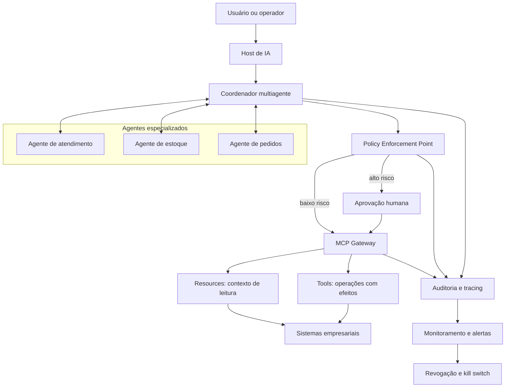

# Design de sistema multiagente: síntese do diálogo

## Objetivo

Este documento registra as decisões e os aprendizados de uma sessão sobre o design de um sistema multiagente empresarial. A proposta amplia a arquitetura MCP existente com coordenação A2A de forma incremental. Ela representa uma evolução arquitetural planejada; a coordenação multiagente descrita aqui ainda não faz parte da implementação atual do servidor.

## 1. Seleção dos protocolos agênticos

O MCP deve ser o primeiro protocolo adotado porque oferece uma fronteira controlada para descoberta e acesso a recursos, ferramentas e prompts. O servidor continua responsável por autenticação, autorização, validação, transações e auditoria, independentemente da decisão tomada pelo modelo.

O A2A deve ser introduzido somente quando houver necessidade comprovada de delegação ou coordenação entre agentes especializados. Essa adoção incremental evita aumentar a superfície de ataque e a complexidade operacional antes que existam casos de uso, proprietários e contratos claramente definidos.

Princípios de adoção:

- começar com recursos de leitura e ferramentas MCP de baixo risco;
- adicionar ações com efeitos colaterais somente após definir autorização, idempotência e rollback;
- introduzir comunicação A2A para fluxos que realmente exigem múltiplos agentes;
- versionar contratos de mensagens, capacidades e responsabilidades;
- preservar identidade, contexto de autorização e correlação durante toda delegação.

## 2. Arquitetura para equilíbrio entre autonomia e controle

A arquitetura proposta separa planejamento autônomo de execução autorizada. Os agentes podem interpretar objetivos, produzir planos e solicitar colaboração, mas toda operação externa passa por pontos determinísticos de controle.



### Controles essenciais

| Camada | Responsabilidade | Controle principal |
|---|---|---|
| Identidade | Identificar usuário, agente e serviço | credenciais verificadas e de curta duração |
| Autorização | Determinar quais capacidades podem ser usadas | RBAC/ABAC e menor privilégio |
| Coordenação | Delegar tarefas e resolver dependências | contratos explícitos, limites e prioridades |
| MCP | Proteger dados e operações empresariais | validação, filtragem, transações e auditoria |
| Aprovação humana | Controlar decisões de alto impacto | revisão baseada em risco e segregação de funções |
| Observabilidade | Reconstruir decisões e detectar anomalias | correlation ID, traces, métricas e logs imutáveis |
| Contenção | Interromper comportamento inseguro | quotas, circuit breakers, revogação e kill switch |

## 3. Salvaguardas e mitigação de riscos

### Controles preventivos

- escopos estritos, menor privilégio e isolamento entre agentes;
- limites de tempo, custo, tokens, chamadas e profundidade de delegação;
- validação de entradas e saídas antes de executar ferramentas;
- proibição de acesso direto dos agentes a credenciais e sistemas de registro;
- confirmação humana para operações financeiras, destrutivas ou que exponham dados sensíveis;
- testes adversariais contra prompt injection, escalada de privilégio e exfiltração.

### Contenção em tempo de execução

- circuit breakers para agentes, ferramentas e dependências instáveis;
- detecção de ciclos de delegação e de repetição sem progresso;
- controle de concorrência e versionamento otimista de estado;
- monitoramento de desvios em volume, latência, custo e padrão de acesso;
- revogação imediata de identidade e desativação seletiva de ferramentas.

### Recuperação

- idempotency keys para repetição segura;
- transações e rollback para evitar estados parciais;
- filas de mensagens não processadas para análise posterior;
- checkpoints de workflow e retomada a partir do último estado válido;
- implantação canário, feature flags e rollback automatizado;
- revisão pós-incidente convertida em políticas, testes e alertas.

## 4. Cenário concreto de conflito entre agentes

### Situação

Um agente de atendimento promete entrega imediata ao cliente enquanto o agente de estoque detecta que restam apenas duas unidades. Ao mesmo tempo, o agente de pedidos tenta reservar três unidades com base em uma leitura anterior do estoque.

### Resolução orquestrada

```mermaid
sequenceDiagram
    actor U as Operador humano
    participant C as Coordenador
    participant S as Agente de atendimento
    participant I as Agente de estoque
    participant O as Agente de pedidos
    participant P as Policy Engine
    participant M as Servidor MCP

    S->>C: Solicita confirmação de entrega
    I->>C: Informa estoque atual = 2, versão 42
    O->>C: Solicita reserva de 3 unidades, versão 41
    C->>P: Avalia conflito e impacto
    P-->>C: Bloquear escrita; aprovação necessária
    C->>U: Exibe fatos, divergência e opções seguras
    U-->>C: Aprova reserva de 2 e pedido parcial
    C->>M: Executa ferramenta com versão 42 e idempotency key
    M->>M: Autoriza, valida e executa transação
    M-->>C: Reserva confirmada e evento auditado
    C-->>S: Atualizar promessa comunicada ao cliente
    C-->>O: Registrar pedido parcial
```

O coordenador não escolhe arbitrariamente qual agente está correto. A versão desatualizada é rejeitada, a escrita é suspensa e o operador recebe fatos verificáveis e alternativas permitidas. A decisão humana é registrada junto com identidade, justificativa, entradas, política aplicada e resultado.

## 5. Comportamento emergente inesperado

Um segundo risco ocorre quando dois agentes delegam repetidamente a mesma tarefa entre si. O coordenador deve manter um grafo de delegações e interromper o fluxo quando detectar ciclo, falta de progresso ou consumo acima do orçamento.

Resposta operacional:

1. suspender somente o workflow afetado;
2. bloquear novas delegações relacionadas ao correlation ID;
3. preservar mensagens, decisões e estado para investigação;
4. notificar o operador com um resumo do ciclo detectado;
5. permitir retomada manual, fallback determinístico ou cancelamento;
6. transformar a causa em teste de regressão e regra de detecção.

## 6. Matriz de intervenção humana

| Nível | Exemplo | Execução | Intervenção humana |
|---|---|---|---|
| Baixo | consultar estoque não sensível | automática | somente auditoria |
| Médio | criar ticket de suporte | automática com limites | revisão por exceção |
| Alto | alterar estoque ou confirmar pedido excepcional | suspensa até aprovação | aprovação obrigatória |
| Crítico | pagamento, exclusão em massa ou acesso privilegiado | negada por padrão | dupla aprovação e segregação de funções |

A interface de aprovação deve mostrar objetivo, agente solicitante, recurso afetado, parâmetros, dados usados, política acionada, impacto esperado, alternativas e prazo para expiração. Aprovar não concede acesso permanente: a autorização deve ser específica para aquela ação e perder validade após o uso.

## 7. Equilíbrio entre velocidade e responsabilidade

A velocidade deve ser obtida por automação e reutilização de controles, não pela remoção de salvaguardas. Capacidades de baixo risco podem seguir um caminho automatizado, enquanto operações de alto impacto passam por análise de ameaças, privacidade, aprovação e testes adicionais.

Práticas recomendadas:

- componentes reutilizáveis de identidade, autorização, auditoria e observabilidade;
- testes, análise de dependências e políticas executados automaticamente no CI/CD;
- ambientes isolados, feature flags, canários e rollback;
- critérios mínimos de produção que não podem ser ignorados;
- redução de escopo quando um prazo não permite implementar os controles necessários;
- evidências de conformidade geradas pelo próprio pipeline.

## 8. Pontos fortes demonstrados

- seleção estratégica dos protocolos, usando MCP como fronteira governada e A2A somente para coordenação necessária;
- visão integrada de autonomia, segurança, auditabilidade e governança;
- aplicação de menor privilégio, identidades verificadas e contratos explícitos;
- salvaguardas preventivas, contenção, recuperação e melhoria contínua;
- estratégia de entrega baseada em risco, com controles de produção inegociáveis;
- reconhecimento de que decisões do modelo não substituem autorização determinística no servidor.

## 9. Áreas de melhoria e ações propostas

| Área de melhoria | Ação concreta | Evidência esperada |
|---|---|---|
| Conflitos complexos | criar testes com leituras desatualizadas e decisões concorrentes | conflito detectado sem escrita inconsistente |
| Intervenção humana | prototipar a tela e o contrato de aprovação | decisão vinculada a usuário, política e correlation ID |
| Comportamento emergente | simular ciclos, tempestades de mensagens e delegação excessiva | workflow interrompido dentro dos limites definidos |
| Governança A2A | versionar contratos de capacidade, mensagem e responsabilidade | compatibilidade validada no pipeline |
| Recuperação | realizar exercícios de rollback e retomada de checkpoints | RTO/RPO e procedimentos comprovados |
| Métricas | definir SLOs de sucesso, conflito, aprovação, custo e latência | dashboards e alertas acionáveis |

## Conclusão

O principal aprendizado é que autonomia deve existir dentro de limites explícitos e observáveis. MCP oferece a fronteira controlada para dados e ações; A2A pode ampliar a colaboração, mas também exige identidade propagada, contratos, prevenção de ciclos e resolução determinística de conflitos. A intervenção humana deve ser proporcional ao risco, contextualizada e auditável. Dessa forma, o sistema pode evoluir rapidamente sem perder segurança, governança ou capacidade de recuperação.
