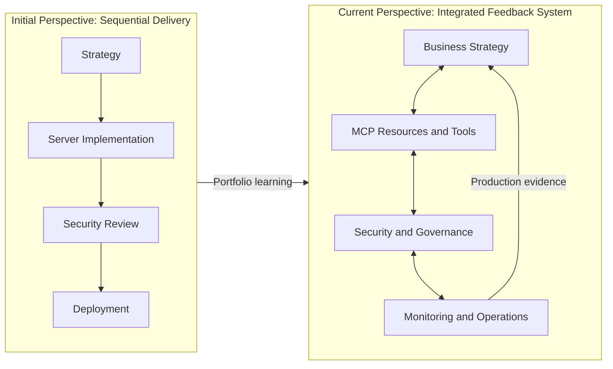
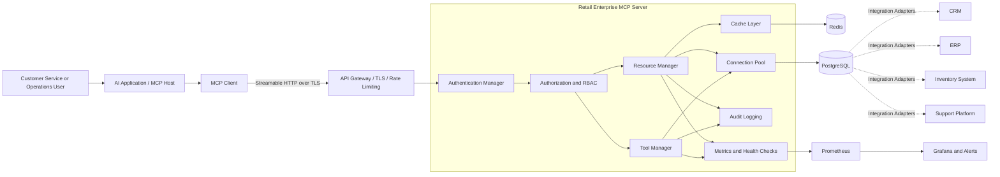
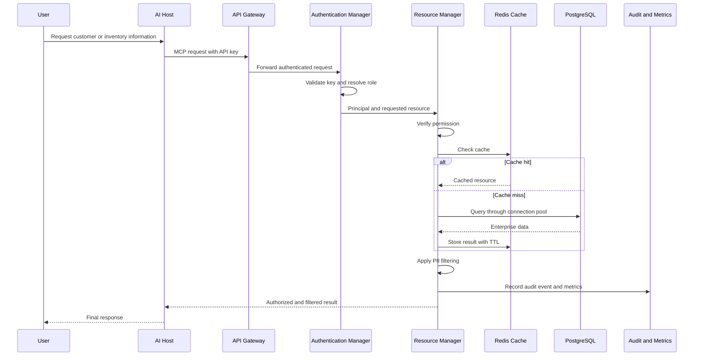
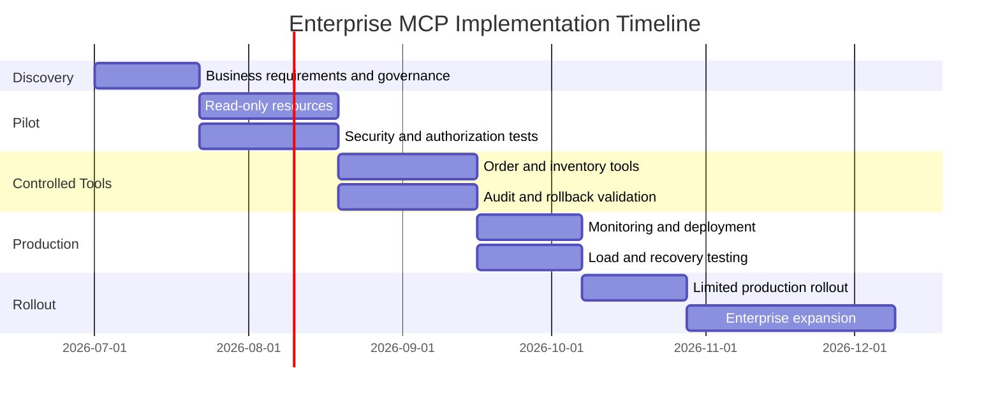
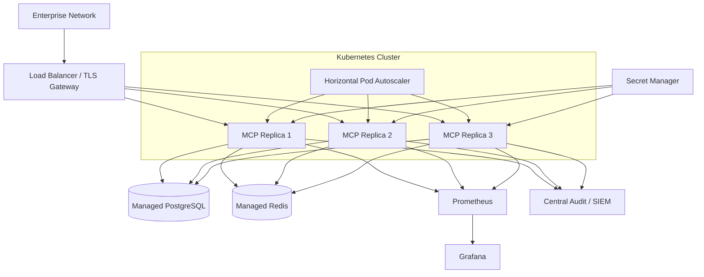
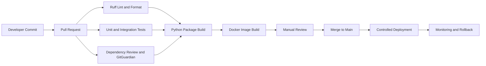
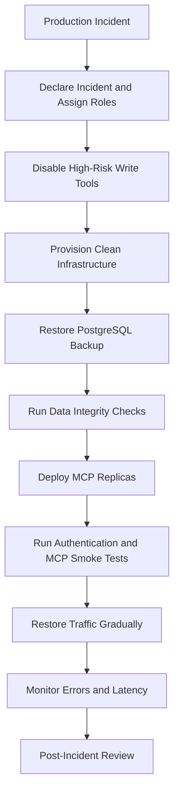

  # MCP Integration Portfolio: Complete Enterprise Implementation

  Student: Thiago Pereira
  Project: Retail Enterprise MCP Platform
  Repository: https://github.com/titi0001/mcp-enterprise-portfolio
  Technology: Python 3.14, MCP SDK, PostgreSQL, Redis, Docker, Kubernetes, Prometheus, Grafana and GitHub Actions

  ## 1. Executive Summary

  This portfolio presents a complete enterprise Model Context Protocol integration for a Fortune 500 retail organization. The company
  needs to connect AI-powered customer service, inventory management and sales analytics to existing CRM, ERP, inventory and customer-
  support platforms.

  The proposed solution uses MCP as a controlled integration layer between AI applications and enterprise data. It exposes customer,
  inventory and sales information as MCP resources, while order processing, inventory updates and customer-support actions are implemented
  as validated MCP tools.

  The solution combines three connected areas:

  1. MCP architecture assessment and design.
  2. Production-ready MCP server implementation.
  3. Enterprise security, monitoring and deployment framework.

  Security and operability are integrated into the architecture rather than added after implementation. The server applies API-key
  authentication, role-based authorization, input validation, data filtering, rate limiting, audit logging, caching, connection pooling,
  metrics, health checks and transactional operations.

  The platform is containerized, horizontally scalable and supported by automated testing and CI/CD. It provides a reusable foundation for
  introducing governed AI capabilities across the company.

  ## 1.1 Integration Perspective Change — Personal Reflection

  Before building this portfolio, I viewed enterprise integration as a mostly sequential process: first define the business architecture,
  then implement the server, and finally add security and deployment controls before production. I understood each discipline separately,
  but I underestimated how strongly a decision in one area changes the requirements of the others. Building the complete MCP solution
  changed my perspective from delivering three related components to engineering one continuous system in which strategy, implementation,
  security and operations must validate each other.

  My first perspective change concerned the relationship between business strategy and MCP protocol design. Initially, I thought the main
  technical task would be mapping existing APIs to MCP. During implementation, I learned that the strategic purpose of each capability must
  determine whether it becomes a resource or a tool. Customer and inventory information became read-oriented resources because the AI needs
  them as context, while order processing, inventory updates and support-ticket creation became tools because they produce business side
  effects. This distinction then influenced authorization, validation, audit requirements and user confirmation. For example, exposing a
  customer record was not simply a data-access problem: the sales-analyst role required masked email addresses, while unauthorized roles had
  to receive no record at all. This showed me that an MCP schema is also a business-policy and data-governance boundary.

  A second change came from connecting scalability with operability. At the start, I associated production readiness mainly with stateless
  HTTP, Docker, caching and database connection pooling. The full Docker Compose test showed why that view was incomplete. MCP resource
  requests worked correctly against PostgreSQL and Redis, but the readiness endpoint returned HTTP 503 because the dependency container
  existed only during stateless MCP request handling. From a functional perspective, the server worked; from an orchestration perspective,
  Kubernetes would have considered the replica unavailable and removed it from service. I corrected the ASGI lifespan ownership, added a
  regression test and repeated the complete-stack smoke test. This experience changed my understanding of monitoring: health checks and
  lifecycle management are not supporting features but part of the server's functional contract in production.

  A third change involved enterprise security. I originally focused on visible runtime controls such as API-key authentication, RBAC, input
  validation, rate limiting and audit logging. After enabling GitHub's dependency graph, Dependabot identified five unique Starlette
  advisories reported across both the project manifest and lockfile. The vulnerable version was not required by the MCP SDK; it remained
  installed because of an upper-version constraint defined by my own project. I updated Starlette, regenerated the lockfile and validated
  the change through unit tests, the MCP protocol smoke test, package generation, Docker build and CI security checks. This demonstrated
  that enterprise security also includes dependency policy, reproducible builds, automated detection and evidence that remediation did not
  break the integration.

  The portfolio also changed how I interpret architecture and ROI documents. I no longer see them as presentation artifacts created before
  coding. The expected reduction in customer-service handling time determines which resources need low latency; that requirement justifies
  Redis caching and latency metrics. The risk of duplicate orders justifies idempotency keys, database uniqueness constraints and
  transactional rollback. Recovery objectives justify stateless replicas, health probes, backups and a tested recovery sequence. In this
  way, strategic assumptions become implementation controls and measurable operational indicators.

  My current perspective is that a production-ready MCP server is not merely a protocol endpoint that exposes resources and tools. It is a
  governed enterprise capability whose business value, schemas, permissions, failure behavior, telemetry and deployment model must be
  designed together. The most important learning from this portfolio was that cohesiveness is achieved through feedback: implementation
  tests the architecture, security constrains implementation, monitoring reveals incorrect assumptions, and operational evidence informs
  the next strategic decision.

  ### Reflection Diagram — How My Integration Perspective Changed

  ———

  # Component 1: MCP Architecture Assessment and Design

  ## 2. Business Context

  The retailer currently operates several independent enterprise systems:

  - CRM containing customer profiles and relationship history.
  - ERP responsible for commercial and financial operations.
  - Inventory databases containing product availability.
  - Customer-support platforms containing tickets and interactions.
  - Analytics systems containing sales and performance information.

  Traditional point-to-point AI integrations would require separate adapters for each AI application and backend system. This would
  increase implementation cost, duplicate security logic and make governance difficult.

  MCP creates a standardized interface in which AI hosts can discover and use approved resources, tools and prompts without understanding
  the internal implementation of each enterprise system.

  ## 3. System Architecture

  ### Figure 1 — Enterprise MCP Architecture

  ## 4. Six Internal MCP Server Components

  The server architecture contains six essential components:

  1. Authentication Manager: Validates API keys and resolves the caller’s identity and role.
  2. Resource Manager: Retrieves, caches, filters and audits enterprise information.
  3. Tool Manager: Validates and executes operations that modify business data.
  4. Connection Pool: Reuses and limits database connections under concurrent traffic.
  5. Cache Layer: Reduces latency and protects backend systems from repeated reads.
  6. Metrics System: Records request volume, latency, failures, cache efficiency and dependency health.

  ## 5. Request Processing Flow

  ### Figure 2 — Secure Resource Request

  ## 6. MCP Compared with Traditional Integration

| Dimension | MCP Integration | Traditional Point-to-Point Integration |
| --- | --- | --- |
| AI interoperability | Standard resources, tools and prompts | Custom integration for each AI client |
| Discoverability | Capabilities can be listed dynamically | Endpoints require external documentation |
| Reuse | One server supports multiple MCP clients | Adapters are frequently duplicated |
| Security | Centralized policy enforcement | Security may vary between integrations |
| Context access | URI-addressed resources | Custom API endpoints |
| Operations | Standard tools with validated schemas | Custom SDK and orchestration logic |
| Change management | Backend details isolated by adapters | Clients may depend directly on backend APIs |
| Maturity | New and evolving ecosystem | Established API ecosystem |

  MCP should not replace every internal API. Existing APIs, event streams and databases remain systems of record behind controlled MCP
  adapters.

  ## 7. Risk Assessment

| Risk | Impact | Mitigation |
| --- | --- | --- |
| Prompt injection triggers an unsafe action | Critical | Server-side RBAC, strict schemas and tool allowlists |
| Customer data leakage | Critical | Permission checks, PII filtering and negative authorization tests |
| API-key exposure | High | TLS, secret management, credential rotation and no secret logging |
| Duplicate orders | High | Idempotency keys and database uniqueness constraints |
| Dependency outage | High | Timeouts, circuit breakers, readiness probes and graceful errors |
| Database exhaustion | High | Connection pooling, rate limiting and horizontal scaling |
| Stale inventory cache | Medium | Short TTL and cache invalidation after writes |
| Sensitive information in logs | High | Metadata-only audit events and controlled retention |
| Vulnerable dependencies | High | Lockfiles, Dependency Review, Dependabot and CI security checks |
| Regional infrastructure failure | Critical | Backups, recovery procedures and cross-region restoration tests |

  ## 8. ROI Analysis

  The following figures provide an illustrative business case:

  - 100 customer-service agents.
  - 30 assisted interactions per agent per day.
  - 250 working days per year.
  - Two minutes saved per interaction.
  - Fully loaded agent cost of USD 30 per hour.
  - Initial implementation cost of USD 180,000.
  - Estimated annual platform cost of USD 60,000.

  Estimated annual capacity released:

  100 × 30 × 250 × 2 ÷ 60 = 25,000 hours

  Estimated productivity value:

  25,000 × USD 30 = USD 750,000 per year

  After annual platform costs, the illustrative benefit is approximately USD 690,000. The estimated implementation payback period is
  approximately four months after production launch.

  These figures represent productivity capacity and must be validated using actual operational measurements.

  ## 9. Implementation Timeline

  ———

  # Component 2: Production MCP Server Implementation

  ## 10. Server Implementation

  The server is implemented in Python using the official MCP SDK and FastMCP. The production transport is stateless Streamable HTTP with
  JSON responses, allowing multiple replicas to operate behind a load balancer.

  The application uses ports and adapters to separate MCP protocol handling from business and infrastructure logic.

  Main implementation areas include:

  - Typed configuration.
  - Authentication and role resolution.
  - Resource and tool managers.
  - Domain validation with Pydantic.
  - PostgreSQL repository.
  - Redis and in-memory cache adapters.
  - Connection pooling.
  - Circuit breaker.
  - Prometheus metrics.
  - Structured audit logging.
  - ASGI health and metrics endpoints.

  ## 11. MCP Resources

  ### Customer Resource

  URI: retail://customers/{customer_id}
  Permission: customer:read

  Returns an authorized customer profile. Sales analysts receive a masked email address, while unauthorized roles cannot retrieve the
  resource.

  ### Inventory Resource

  URI: retail://inventory/{sku}
  Permission: inventory:read

  Returns product name, available quantity, reorder threshold, unit price and update timestamp.

  ### Sales Resource

  URI: retail://sales/{sale_id}
  Permission: sales:read

  Returns a confirmed sales transaction only when the authenticated role has access to sales data.

  ## 12. MCP Tools

  ### Process Order

  Creates a sales record and decreases inventory inside one database transaction.

  Security and reliability controls include:

  - order:write permission.
  - Typed and bounded inputs.
  - Customer and inventory validation.
  - Row-level inventory locking.
  - Inventory availability verification.
  - Required idempotency key.
  - Automatic transaction rollback.
  - Audit event generation.

  ### Update Inventory

  Updates a SKU quantity while preventing negative inventory.

  Controls include:

  - inventory:write permission.
  - Maximum adjustment bounds.
  - Required business reason.
  - Atomic database update.
  - Cache invalidation.
  - Audit logging.

  ### Create Support Ticket

  Creates a support ticket associated with an existing customer.

  Controls include:

  - ticket:write permission.
  - Subject and description length limits.
  - Control-character rejection.
  - Priority validation.
  - Customer validation.
  - Audit logging.

  ## 13. Role-Based Access Control

| Capability | Customer Service | Inventory Manager | Sales Analyst | Administrator |
| --- | --- | --- | --- | --- |
| Read customers | Yes | No | Masked PII | Yes |
| Read inventory | Yes | Yes | Yes | Yes |
| Update inventory | No | Yes | No | Yes |
| Read sales | No | Yes | Yes | Yes |
| Process orders | No | No | No | Yes |
| Create support tickets | Yes | No | No | Yes |

  Authorization is deterministic and enforced by the server. The AI model cannot grant itself permissions or bypass role restrictions.

  ## 14. Error Handling and Resilience

  The implementation provides:

  - Client-safe error messages.
  - Detailed internal logging without exposing secrets.
  - Database transaction rollback.
  - Timeouts for dependency operations.
  - Circuit breaking after repeated failures.
  - Idempotent order processing.
  - Cache invalidation after writes.
  - Liveness and readiness endpoints.
  - Graceful dependency cleanup during shutdown.

  ———

  # Component 3: Enterprise Security and Deployment Framework

  ## 15. Security Architecture

  Security controls are applied at multiple layers:

  - TLS termination at the gateway.
  - API-key authentication for the portfolio scenario.
  - Role-based access control.
  - Least-privilege permissions.
  - Input validation and sanitization.
  - PII filtering.
  - Request and payload limits.
  - Per-principal rate limiting.
  - Transactional writes.
  - Secure error responses.
  - Audit logging.
  - Secret injection through environment or secret-management systems.
  - Read-only container filesystem.
  - Non-root container execution.
  - Dropped Linux capabilities.
  - Dependency and container checks in CI.

  In a mature enterprise deployment, API keys should be replaced with OAuth 2.1, audience-bound access tokens and the corporate identity
  provider.

  ## 16. Deployment Architecture

  ### Figure 3 — Production Deployment

  ## 17. Monitoring and Observability

  The server exposes Prometheus metrics for:

  - Request count by operation and outcome.
  - Request latency histograms.
  - Cache hits and misses.
  - In-flight requests.
  - Database health.
  - Redis health.
  - Authentication failures.
  - Tool execution failures.

  Grafana provides dashboards for request rate, p95 latency, cache hit ratio, active requests and dependency health.

  Configured alerts include:

  - MCP server unavailable.
  - Error rate above 5%.
  - p95 latency above one second.
  - Database dependency unavailable.

  Audit events contain:

  - Timestamp.
  - Request ID.
  - Authenticated subject.
  - Role.
  - Action.
  - Target resource.
  - Outcome.
  - Safe error type.

  Credentials, prompts and unnecessary customer PII are not written to audit logs.

  ## 18. CI/CD Pipeline

  ### Figure 4 — CI/CD Flow

  The pipeline validates:

  - Python formatting and linting.
  - Unit and integration tests.
  - Minimum code coverage.
  - Dependency security.
  - Secret exposure.
  - Python package generation.
  - Docker image construction.

  ## 19. Test and Validation Results

  The implementation was validated using Python 3.14.5 managed through asdf.

  Results:

  - 25 automated tests passed.
  - Code coverage: 77.44%.
  - Ruff linting passed.
  - Ruff formatting passed.
  - Python wheel and source distribution built successfully.
  - Docker image built successfully.
  - Docker Compose configuration validated.
  - PostgreSQL and Redis health checks passed.
  - MCP container health check passed.
  - Readiness endpoint returned HTTP 200.
  - MCP protocol smoke test passed.
  - Three tools discovered.
  - Three resource templates discovered.
  - One prompt discovered.
  - Inventory resource successfully retrieved through MCP.
  - Dependency Review, container build and GitGuardian checks passed.
  - Dependabot open alerts reduced to zero.

  ## 20. Disaster Recovery and Business Continuity

  Recovery objectives:

  - Recovery Time Objective: 60 minutes.
  - Recovery Point Objective: 15 minutes.

  ### Figure 5 — Recovery Process

  PostgreSQL uses encrypted snapshots and continuous transaction-log archiving. Redis is treated as reconstructible cache data rather than
  a system of record.

  Recovery exercises should be performed quarterly, with automated restoration validation every month.

  The platform supports enterprise growth through:

  - Stateless MCP HTTP replicas.
  - Horizontal Pod Autoscaling.
  - Bounded PostgreSQL connection pools.
  - Shared Redis caching.
  - Short cache TTL for inventory.
  - Cache invalidation after writes.
  - Per-request timeouts.
  - Rate limiting.
  - Circuit breakers.
  - Idempotent operations.
  - Database indexes.
  - Readiness-based traffic removal.
  - Load testing at twice the expected peak traffic.

  Database pool sizes must be calculated across all replicas to avoid exceeding the database connection limit.

  ## 22. Design Trade-offs

  ### API Keys versus OAuth

  API keys meet the project scenario and simplify demonstration. OAuth 2.1 is recommended for production user delegation, token expiration
  and centralized identity governance.

  ### Projection Database versus Direct Backend Calls

  A PostgreSQL integration projection improves transaction control and isolates source systems. It introduces synchronization
  responsibilities that must be managed through APIs or event streams.

  ### Stateless HTTP versus Stateful Sessions

  Stateless HTTP improves horizontal scalability and failure recovery. Workflows requiring persistent server-side session state need a
  shared external state mechanism.

  ### Caching versus Data Freshness

  Caching improves response time and protects backend systems. Inventory uses short TTLs and invalidation after writes to limit stale
  information.

  ## 23. Future Roadmap

  Future improvements include:

  1. Replace API keys with OAuth 2.1 and corporate identity integration.
  2. Add tenant identity to principals, database queries and cache keys.
  3. Integrate real CRM, ERP and support APIs.
  4. Introduce event-driven data synchronization.
  5. Add human approval for high-value or destructive operations.
  6. Implement cross-region deployment and automated failover.
  7. Add load and penetration testing to release gates.
  8. Sign container images and generate deployment provenance.
  9. Implement automated SBOM generation.
  10. Expand role-specific MCP capability discovery.

  ## 24. Conclusion

  This portfolio demonstrates that a production-ready MCP implementation requires more than exposing tools to an AI model. Business
  strategy, protocol design, backend integration, authorization, monitoring, testing and operational recovery must work as one cohesive
  system.

  The resulting solution provides a secure and scalable foundation for connecting enterprise AI applications to retail data and
  operations. It maintains deterministic security boundaries, protects sensitive customer information, supports horizontal scaling and
  provides the observability required for production operation.

  The project also demonstrates a complete engineering lifecycle: architecture assessment, implementation, security analysis, automated
  testing, containerization, CI/CD, monitoring, dependency remediation and full-stack validation.
